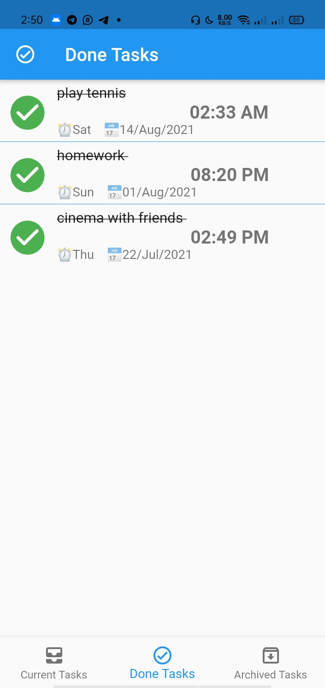

# Task List Using 

 

  
 
  <h2 align="center"> Task List </h2>

 

 A Flutter Project to create tasks and and save it in the app using sqlite and you can delete tha task or archive it  

---

## Sections

- [App Architecture](#app_architecture)
- [App Gif Screen](#GIF_Screens)
- [Packages And Dependacies](#Packages_And_Dependacies)
- [App Screen](#App_Screen)

---

## app_architecture

## 

## GIF_Screens

    <table>
        <tr>
                  
                 
                       
        </tr>
         <tr>
                  
                 
                       
        </tr>
    </table>

---

## Packages_And_Dependacies

- flutter_bloc:
- sqflite:
- path:
- intl:
- fluttertoast:
- flutter_staggered_animations:
- equatable:
- flutter_slidable:
- animate_icons:
- lint:

## App_Screen

    <table>
        <tr>
            <td> 
                
            </td> 
            <td> 
                
            </td> 
            <td> 
                
            </td> 
            <td> 
                
            </td> 
            <td>
                
            </td>          
        </tr>
    </table>

    <table>
        <tr>
            <td> 
                
            </td> 
            <td> 
                
            </td> 
            <td> 
                
            </td> 
            <td> 
                
            </td> 
            <td>
                
            </td>          
        </tr>
    </table>

    <!--  -->

